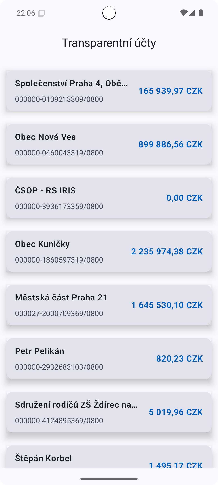
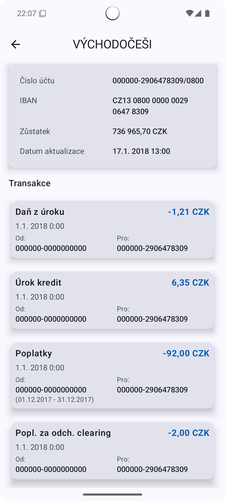

# Transparent Accounts Android App

Android application displaying transparent account data through the Erste Group Developer Portal
API.

## Features

- **Transparent accounts list** - display all available transparent accounts
- **Account detail** - detailed information about selected transparent account

## Technologies

- **Jetpack Compose** - UI toolkit
- **Kotlin** - programming language
- **Koin** - dependency injection
- **Ktor** - HTTP client for network communication
- **Material Design 3** - design system
- **Architecture Components** - ViewModel, StateFlow

## Architecture

The app uses **Clean Architecture** with layer separation:

```
├── domain/          # Business logic (Use Cases)  
├── data/            # Data layer (Repository, API)
├── model/          # Business models
├── ui/            # UI layer (Compose screens)
├── presentation/     # Presentation layer (ViewModels, UI states)
└── system/          # System implementations
```

## API

The app communicates with **Erste Group Developer Portal API**:

- **Base URL**: `https://webapi.developers.erstegroup.com/api/csas/public/sandbox/v3`
- **Endpoints**:
  - `GET /transparentAccounts` - list of transparent accounts
  - `GET /transparentAccounts/{accountNumber}` - account detail

### Authentication

API requires `WEB-API-key` header for authentication.

## Setup

App requires Android API 24+ (Android 7.0)

```bash
# Clone repository
git clone <repository-url>
cd homework

# Build and install
./gradlew installDebug

# Run tests
./gradlew test
```

## Screenshots

### Accounts List



### Account Detail


